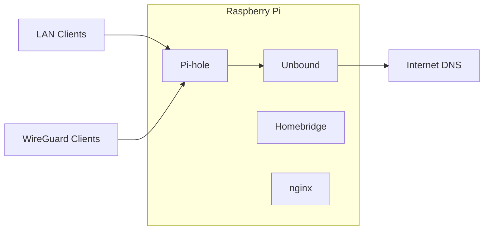

# Pi Services

> Opinionated infrastructure for a privacy-first, Apple-friendly home network.


Pi Services is a Docker Compose stack that combines private DNS, VPN access, home automation, and reverse proxy services into a cohesive, easy-to-maintain home server.

---

## Why Pi Services?

Many Raspberry Pi home server projects are collections of unrelated containers. Pi Services is designed as an integrated platform with:

- Privacy-first recursive DNS using Unbound
- Network-wide DNS filtering with Pi-hole
- Secure remote access with WireGuard
- Apple Home integration through Homebridge
- Simple, reproducible Docker Compose deployment
- Dual-stack Docker networking (IPv4 + IPv6)

---

## Architecture



DNS queries are filtered by Pi-hole and resolved recursively by Unbound using the Internet DNS hierarchy with DNSSEC validation—no public recursive resolver required.

---

## Services

| Service | Purpose |
|----------|---------|
| Pi-hole | Network-wide DNS filtering |
| Unbound | Recursive DNS resolver with DNSSEC |
| WireGuard | Secure remote VPN access |
| Homebridge | Apple Home integration |
| nginx | Reverse proxy for local services |

---

## Quick Start

```bash
git clone https://github.com/weitzner/pi-services.git
cd pi-services

./initialize-config-files.sh

docker compose up -d
```

See the installation guide for complete setup instructions.

---

## Documentation

| Guide | Description |
|--------|-------------|
| `docs/installation.md` | Install and deploy Pi Services |
| `docs/configuration.md` | Configure environment variables |
| `docs/networking.md` | DNS architecture and networking |
| `docs/services.md` | Service overview |
| `docs/maintenance.md` | Updates, backups, and troubleshooting |
| `docs/security.md` | Security considerations |
| `docs/contributing.md` | Contributing guidelines |
| `docs/roadmap.md` | Planned improvements |

---

## Design Principles

- **Privacy first** — Resolve DNS recursively without relying on public recursive resolvers.
- **Reproducibility** — Deploy everything with Docker Compose.
- **Simplicity** — Keep configuration explicit and easy to understand.
- **Reliability** — Use predictable networking and static container addressing.
- **Apple-friendly** — Integrate cleanly with Apple Home through Homebridge.

---

## Contributing

Contributions, bug reports, and suggestions are welcome.

See [`docs/contributing.md`](docs/contributing.md) for details.

---

## License

Licensed under the Apache License 2.0. See the [LICENSE](LICENSE) file for details.