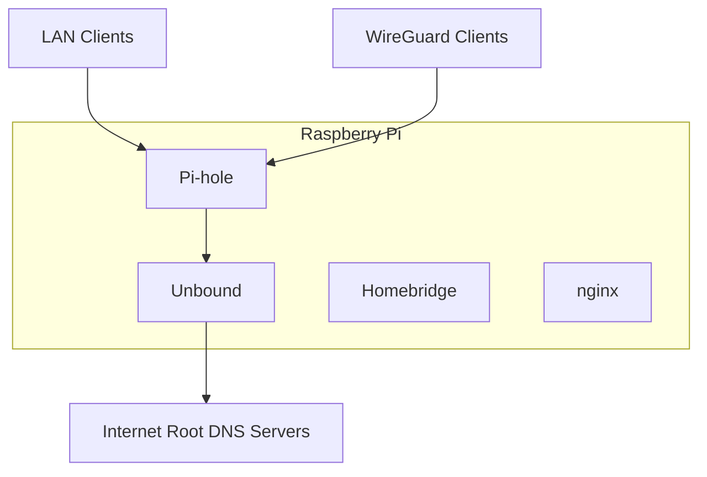
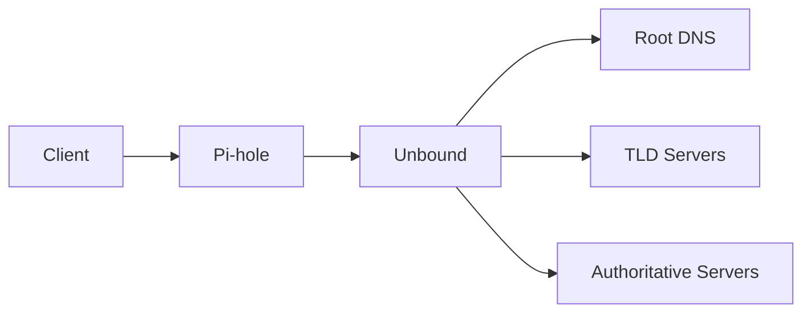

# Pi Services

[](LICENSE)
[](https://www.docker.com/)
[](https://www.raspberrypi.com/)
[](docs/networking.md)

> Opinionated infrastructure for a privacy-first, Apple-friendly home network.

Pi Services is a reproducible Docker Compose stack that provides the core infrastructure for a modern home network, including recursive DNS, network-wide ad blocking, secure remote access, and Apple Home integration.

Designed for Raspberry Pi, it emphasizes privacy, simplicity, and long-term maintainability over unnecessary complexity.

---

## Features

- Recursive DNS with Unbound (no third-party recursive resolver)
- DNSSEC validation
- Network-wide DNS filtering with Pi-hole
- WireGuard VPN for secure remote access
- Homebridge for Apple Home integration
- nginx reverse proxy
- Dual-stack Docker networking (IPv4 + IPv6)
- Static container addressing
- Cloudflare Dynamic DNS updates
- Fully managed with Docker Compose

---

## Architecture



### Recursive DNS Resolution



Unlike many Pi-hole deployments, Unbound performs full recursive resolution directly against the Internet DNS hierarchy. No Cloudflare, Google, Quad9, or other public recursive DNS provider is required.

---

## Quick Start

Clone the repository.

```bash
git clone https://github.com/weitzner/pi-services.git
cd pi-services
```

Generate the local configuration files.

```bash
./initialize-config-files.sh
```

Edit the generated configuration.

```text
services/.env
scripts/.env
```

Start the stack.

```bash
docker compose up -d
```

Verify the deployment.

```bash
docker compose ps
```

For complete installation instructions, see **docs/installation.md**.

---

## Documentation

| Guide | Description |
|--------|-------------|
| **installation.md** | Installation and first deployment |
| **configuration.md** | Environment variables and customization |
| **services.md** | Pi-hole, Unbound, WireGuard, Homebridge, and nginx |
| **networking.md** | Docker networking, IPv4, IPv6, and service addressing |
| **operations.md** | Updating containers, backups, and common administration |
| **security.md** | Security model and recommended hardening |
| **architecture.md** | Design decisions and system architecture |

---

## Design Principles

Pi Services is built around a few guiding principles.

- **Privacy first** — Resolve DNS without relying on public recursive resolvers.
- **Simple by default** — Favor explicit configuration over automation.
- **Reproducible** — Everything is managed with Docker Compose.
- **Reliable** — Static networking and isolated services reduce operational surprises.
- **Apple-friendly** — Integrates cleanly with Apple Home through Homebridge.
- **Maintainable** — Documentation is treated as part of the project.

---

## Roadmap

Future improvements include:

- Automatic Unbound root hints updates
- Native IPv6 support for WireGuard clients
- Automatic container updates
- Health monitoring
- Prometheus and Grafana integration
- Backup and restore automation
- Continuous integration

---

## Contributing

Contributions are welcome.

Please read [CONTRIBUTING.md](CONTRIBUTING.md) before opening an issue or pull request.

---

## License

Licensed under the Apache License 2.0. See [LICENSE](LICENSE).