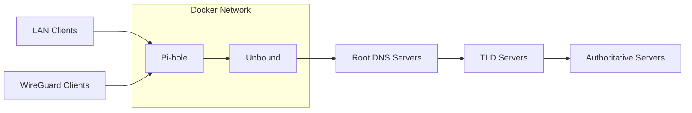

# Networking

Pi Services uses a dedicated dual-stack Docker bridge network with static container addressing to provide deterministic service discovery and predictable networking between services.

---

## Architecture



DNS queries are filtered by Pi-hole and resolved recursively by Unbound. Unlike many Pi-hole deployments, Unbound does not forward requests to a public recursive resolver such as Cloudflare or Google. Instead, it performs full recursive resolution using the Internet DNS hierarchy with DNSSEC validation.

---

## Container Network

### IPv4

```
172.30.0.0/24
```

### IPv6

```
fd55:edc3:aa22:30::/64
```

| Service | IPv4 | IPv6 |
|----------|------|-------|
| Unbound | 172.30.0.2 | fd55:edc3:aa22:30::2 |
| Pi-hole | 172.30.0.3 | fd55:edc3:aa22:30::3 |
| WireGuard | 172.30.0.4 | fd55:edc3:aa22:30::4 |

Static container addresses simplify service discovery and make configuration easier to understand and troubleshoot.

---

## Design

The networking configuration is intentionally simple:

- Dedicated Docker bridge network
- Dual-stack IPv4/IPv6 networking
- Static container IP addressing
- Recursive DNS with DNSSEC validation
- No dependency on third-party recursive DNS providers
- Predictable inter-container communication